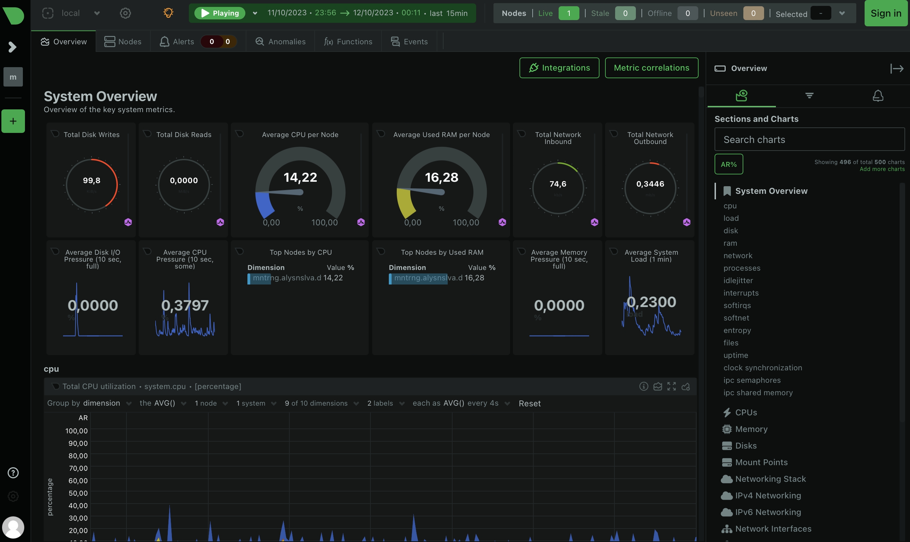
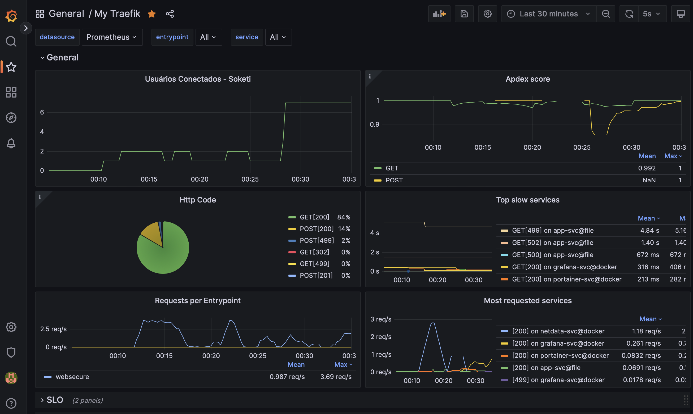
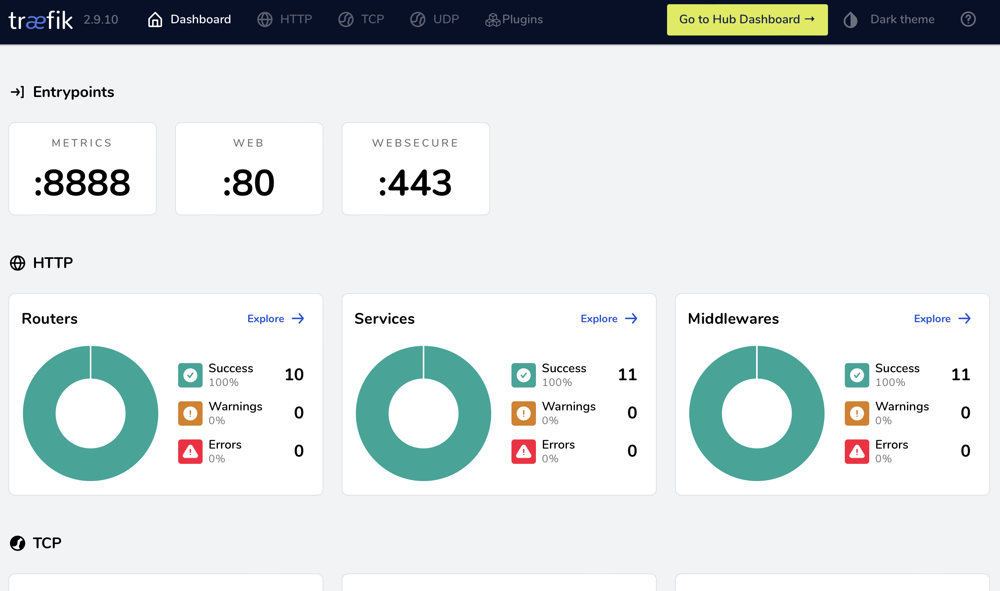

<h1 align="center">
    <br>
    
    
    
    
    
    
    
    
    
    
    <br/>
    Blog Laravel Dockerized
</h1>

<br/>

> 🐳 Docker utilizado na execução do meu site / blog pessoal.

Uma coleção de ferramentas, serviços e imagens executados em docker: **Laravel**, **Laravel Octane**, **Swoole**,  **Grafana**, **MongoDB**, **MySQL**, **Netdata**, **Php**, **Portainer**, **Prometheus**, **Redis**, [**Soketi**](https://docs.soketi.app), **Traefik** e [**Uptime Kuma**](https://github.com/louislam/uptime-kuma).


## Estrutura do Repositório

```bash
tree --sort=name --dirsfirst -a -I ".git|.DS_Store"
```

```
.
├── grafana
│   ├── datasources
│   │   └── ds-prometheus.yml
│   ├── .env.container
│   └── docker-compose.yml
├── mongodb
│   ├── .env.container
│   ├── docker-compose.yml
│   └── mongod.conf
├── mysql
│   ├── scripts
│   │   ├── init.sh
│   │   └── init.sql
│   ├── ssl
│   │   └── .gitignore
│   ├── .env.container
│   ├── docker-compose.yml
│   └── my.cnf
├── netdata
│   ├── configs
│   │   ├── alarms
│   │   │   ├── cgroups.conf
│   │   │   ├── cpu.conf
│   │   │   ├── mysql.conf
│   │   │   └── ram.conf
│   │   ├── modules
│   │   │   └── go.d
│   │   │       ├── mysql.conf
│   │   │       ├── redis.conf
│   │   │       └── traefik.conf
│   │   ├── orchestrators
│   │   │   └── go.d.conf
│   │   ├── health.conf
│   │   └── netdata.conf
│   └── docker-compose.yml
├── php
│   ├── configs
│   │   ├── conf.d
│   │   │   └── opcache.ini
│   │   ├── queue
│   │   │   ├── templates
│   │   │   │   ├── laravel-horizon.conf.tpl
│   │   │   │   └── laravel-worker.conf.tpl
│   │   │   └── supervisord.conf
│   │   ├── php-local.ini
│   │   └── php-production.ini
│   ├── services
│   │   ├── app
│   │   │   ├── .env.container
│   │   │   └── docker-compose.yml
│   │   ├── queue
│   │   │   ├── .env.container
│   │   │   └── docker-compose.yml
│   │   └── scheduler
│   │       ├── .env.container
│   │       └── docker-compose.yml
│   ├── Dockerfile
│   └── docker-entrypoint.sh
├── portainer
│   └── docker-compose.yml
├── prometheus
│   ├── configs
│   │   └── prometheus.yaml
│   └── docker-compose.yml
├── redis
│   ├── docker-compose.yml
│   └── redis.conf
├── scripts
│   ├── cloudflare-ips-ufw.sh
│   ├── deploy-new-version.sh
│   └── self-signed-SSL.sh
├── soketi
│   ├── .env.container
│   └── docker-compose.yml
├── traefik
│   ├── dynamic
│   │   ├── 10-tls.yml
│   │   ├── app-service.yml
│   │   ├── dashboard.yml
│   │   ├── middlewares.yml
│   │   ├── routers.yml
│   │   └── services.yml
│   ├── letsencrypt
│   │   └── .gitignore
│   ├── .gitignore
│   └── docker-compose.yml
├── uptime
│   └── docker-compose.yml
├── .dockerignore
├── .editorconfig
├── .env.compose
├── .gitignore
├── LICENSE
├── Makefile
├── README.md
├── blog-bockerized.service
└── docker-compose.yml
```

## 🔧 Configuração Inicial

### ⬇️ Clonar o repositório

Dentro do GIT de um projeto em _Laravel Octane_ no root do projeto, baixe esse mesmo repositório para uma pasta chamada `docker` com o seguinte comando:

```
$ git clone https://github.com/allysonsilva/blog-docker docker && cd docker
```

### 🗂️ Organização

- A pasta de `docker` deve estar no root do projeto / aplicação em Laravel.
    - O nome da pasta pode ser alterado na env de `DOCKER_FOLDER` no arquivo de `.env` dentro da pasta `docker`.

Deve estar como da seguinte forma:

```
.
└── /var/www/app
                ├── app
                ├── bootstrap
                ├── config
                ├── database
                ├── docker <-------
                └── ...
```

### 🪡 Comandos / Instruções

- Dentro da pasta de `docker`, execute `make docker/config-env docker_folder=./docker` para criar o arquivo `.env` com os valores corretamente.
- Copie o arquivo de `.dockerignore` para a pasta root da aplicação com `cp .dockerignore ./../`.
- Abrir o arquivo `docker/.env` e editar as variáveis de `APP_DOMAIN` e `APP_SECONDARY_DOMAIN` para o valor do domínio da aplicação para que os certificados da Let's Encrypt possam ser criados por meio do desafio DNS com Cloudflare.
    - A renovação dos certificados acontecem de forma automática pelo Traefik.
- Editar a variável `CF_DNS_API_TOKEN` seguindo a recomendação https://go-acme.github.io/lego/dns/cloudflare/#api-tokens.

## 🐳 Execução dos Containers Docker

_Obs: Todos os comandos a seguir devem ser executados de dentro da pasta de `docker`._

Execute `docker compose up` para que possam ser criados networks do docker que serão usandos nos containers da stack.

### 🏗️ Build da imagem da aplicação

*Apenas na primeira execução do build*, deve-se adicionar o parâmetro de `no_cache_from=true`, nas demais build, esse parâmetro não é obrigatório / necessário.

Dentro da pasta `docker` execute os seguintes comandos:

```bash
# Build das multi-stage parts
make docker/app/vendor/build no_cache_from=true
make docker/app/frontend/build no_cache_from=true
make docker/app/dependencies/build no_cache_from=true

# Build do APP
make docker/app/build
```

### Executando o container do **MySQL**

Executa o script para criar os certificados auto-assinados:

```bash
./docker/scripts/self-signed-SSL.sh --service=mysql --cert-server-host=mysql
```

Abrir o arquivo de `docker/mysql/.env` e editar os valores das credencias de login do MySQL.

Subir o container com `make docker/database/up` e para fazer _healthcheck_ utilize `make docker/healthcheck container=app_mysql` onde `app_mysql` é o nome do container do MySQL.

### Executando o container do **Redis**

Abrir o arquivo de `docker/redis/redis.conf` e editar a diretiva de `requirepass` para o password de sua preferência.

Executar `make docker/redis/up` com health em `make docker/healthcheck container=app_redis`.

### Executando o container do **Traefik**

Executar os seguintes comandos:

```bash
make docker/service/up context=traefik services="traefik-whoami"
make docker/traefik/up
```

### Executando o container do [Soketi](https://docs.soketi.app) 📡

```bash
make docker/service/up context=soketi
```

### Executando o container do Portainer

```bash
make docker/service/up context=portainer
```

### Executando o container do Prometheus e Grafana

```bash
make docker/service/up context=prometheus
make docker/service/up context=grafana
```

### Executando o container do Netdata

```bash
VIRTUALIZATION=$(systemd-detect-virt -v) make docker/service/up context=netdata
```

### Executando o container do [Uptime Kuma](https://github.com/louislam/uptime-kuma)

```bash
make docker/service/up context=uptime
```

### Executando o container do **APP** 🚀

_Ver arquivo de `docker/php/services/app/.env` e editar as variáveis de ambiente conforme necessário._

O container do aplicativo executa o **LARAVEL OCTANE** com **SWOOLE**, produzindo o seguinte comando principal: `php artisan octane:start --server=swoole`.

Execute com: `./scripts/deploy-new-version.sh`

## Executando o container da **QUEUE** 🚦

Para executar o _container de fila_, é o seguinte comando: `make docker/queue/up with_version=true`.

O processo principal do container executará o comando `supervisord --nodaemon --configuration /etc/supervisor/supervisord.conf`.

## Executando o container da **SCHEDULER** ⏲️

Para executar o _container de agendamento_, é o seguinte comando: `make docker/scheduler/up with_version=true`.

O processo principal do container executará o comando `crond -l 2 -f -L /var/log/cron.log`.

## Screenshots de Algumas Ferramentas

**Netdata**


**Grafana**


**Uptime Kuma**


**Traefik**


## 📝  Changelog

Please see [CHANGELOG](CHANGELOG.md) for more information about the changes on this package.

## 🤝  Contributing

Please see [CONTRIBUTING](CONTRIBUTING.md) for details.

## License

The MIT License (MIT). Please see [License File](LICENSE.md) for more information.
